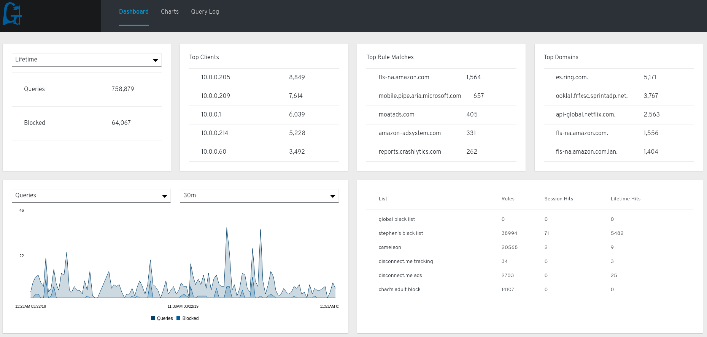

# Gudgeon [](https://travis-ci.org/chrisruffalo/gudgeon) [](https://goreportcard.com/report/github.com/chrisruffalo/gudgeon) [](https://app.fossa.io/projects/git%2Bgithub.com%2Fchrisruffalo%2Fgudgeon?ref=badge_shield)

## Overview
Gudgeon is a caching/blocking DNS proxy server. What sets Gudgeon apart is the ability to segregate machines, subnets, and IP ranges into different groups that 
all receive different blocking rules. The motivation for Gudgeon comes from the proliferation of devices on my home network that belong either to outside entities 
(Google, AT&T, Amazon), kids, or unwise adults. Different groups, classes of user, and devices need different blocking rules.

Take, for example, a user who has shown persistent inability to avoid internet scams. You can assign that user's machine(s) to group(s) that block more suspicious DNS requests. 
On the other hand you might want to allow a device like a Google Home or Alexa unit to have full access to the internet except for tracking/advert websites. You might want to 
create extensive blocklists to protect kids who use the internet from their devices.

For all of these reasons Gudgeon has been created to allow more flexibility in host-based DNS blocking.



## Contents
* [History](docs/HISTORY.md)
* [Acknowledgements](docs/ACK.md)
* [Concept of Operations](docs/OPERATIONS.md)
* [Configuration](docs/CONFIG.md)
* [Practical Example Config](docs/PRACTICAL.md)
* [Feature Roadmap](docs/ROADMAP.md)
* [Questions & Answers](docs/QA.md)
* [What About...](docs/WHATABOUT.md)
* [Screenshots](docs/SCREENSHOTS.md)

## Features
* Go Routines for non-blocking request handling enables high-throughput especially with simultaneous requests
* Systemd Integration to run as non-root user (with access to privileged ports through Systemd sockets)
* Configure upstream DNS types (tcp-tls/dns-over-tls, tcp, and udp) explicitly
* Use regular expressions and wildcards to block DNS names
* Match a client address (or subnet, or subnet range) to a group and determining what blocklists to use
* Resolvers and resolver groups for certain/specific subnets based on matching incoming connections
* Inline host file entries in configuration file as well as external host files
* Enhanced (and backwards-compatible) hostname format supports wildcard names, CNAME/PTR entries, and reverse lookups
* Use Zone DB files to support more record types than hostnames
* A Web UI to show details about current system status
* Query logging with the ability to view recent queries in the Web UI
* Reloading source resolver files when they change

## How Do I Install Gudgeon?
There are a few different ways to install Gudgeon that *don't* require you to build it yourself. Gudgeon aims to support recent of releases Debian, Ubuntu, RHEL/CentOS, and Fedora as well as Docker and ARM builds.

### GitHub Releases
New tagged releases are automatically built by Travis-CI and uploaded to GitHub for download. Functionally these releases are identical to releases available in other channels. You can find these releases [here](https://github.com/chrisruffalo/gudgeon/releases).

### Fedora Releases
Gudgeon has a [COPR repository](https://copr.fedorainfracloud.org/coprs/cruffalo/gudgeon/) for Fedora 28, 29, and CentOS 7. 
```bash
#optional, may be required for CentOS/EL linux
[user@host] yum install yum-plugin-copr
# enable COPR and install gudgeon, use appropriate yum commands on non-dnf platforms
[user@host] sudo dnf copr enable cruffalo/gudgeon
[user@host] sudo dnf install -y gudgeon
```

### Docker Releases
Gudgeon also comes in container form from `gudgeon/gudgeon`.

The Docker container exposes ports 5354 (dns) and 9009 (http) and those ports should be published via the `docker` command. Remember to use `/tcp` and `/udp` when exposing the DNS ports. For persisting/modifying the configuration and for persisting data, metrics, and logs there are two directories in the container. The first directory `/etc/gudgeon` is for configuration files. The data is stored in `/var/lib/gudgeon`. The version can be any tag v0.3.13 or later. See the [docker hub](https://hub.docker.com/r/gudgeon/gudgeon) page for tags and more details.

```bash
[user@host] docker run -ti -p 53:5354/tcp -p 53:5354/udp -p 9009:9009 -v /etc/gudgeon:/etc/gudgeon -v /var/lib/gudgeon:/var/lib/gudgeon gudgeon/gudgeon:${version}
```

### Direct Binary Download
Alongside the release artifacts Gudgeon also provides These files can be downloaded and put on your local path and executed. To do this you will also need a configuration file (example configuration files are provided in the root of this project) and a directory to use as the home directory. (Both `/usr/local/gudgeon` and `/var/lib/gudgeon` are good examples but `/opt/gudgeon` is also acceptable.)

Once these files are in place you can run Gudgeon directly with `gudgeon -c /path/to/your/gudgeon.yml`.

## Building
Prerequisites
* Ability to use Makefiles (`make` command installed)
* Git
* Go >= 1.11 (module support is *required*)
* Docker (for building docker images or xgo support)
* System specific static artifacts for Ruby, NPM, GLIBC, and Sqlite3
  * Fedora: make automake gcc gcc-c++ curl sqlite sqlite-devel glibc glibc-static glibc-headers glibc-devel npm
  * Ubuntu: ruby ruby-dev build-essential rpm libsqlite3-dev gcc-multilib and g++-multilib npm
* `fpm` (for building deb/rpm)  

With the prerequisites installed you can build Gudgeon by...
* Preparing your environment with needed Go tools with `[]$ make prepare`
* Prepare NPM environment with `[]$ make npm`
* Downloading vendor assets (react, etc) with `[]$ make webpack` 
  * This needs to be done each time web assets change
  * You can use hot reloading in dev mode with: `[]$ npm run build:dev` and using `go run gudgeon.go` 
* Building the binary for your target platform with `[]$ make build`

The `npm` target is used to download new dependencies when needed. The `prepare` target is only needed if the required Go tools change. The output of the process is a statically compiled for a few different platforms. The binary is statically compiled to make it easily portable to platforms and other systems that do not have libc, recent Golang compilers, or other required libraries.

## License
[](https://app.fossa.io/projects/git%2Bgithub.com%2Fchrisruffalo%2Fgudgeon?ref=badge_large)
